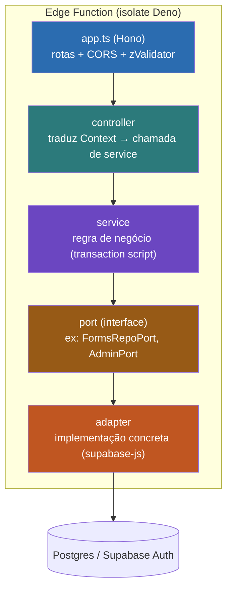
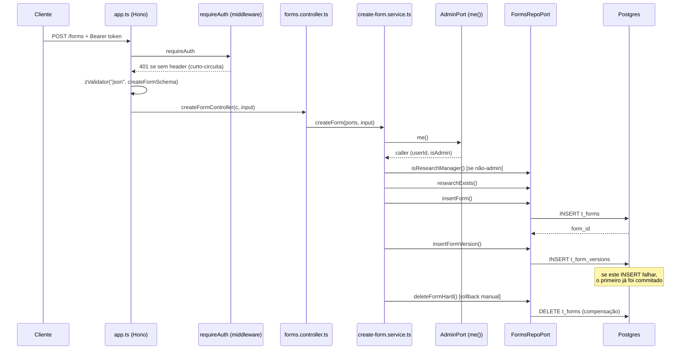
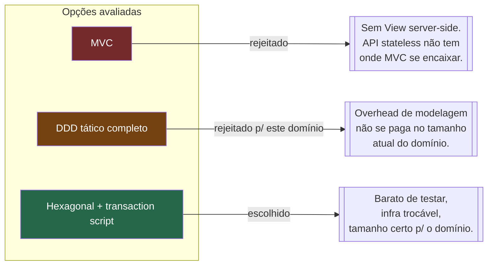
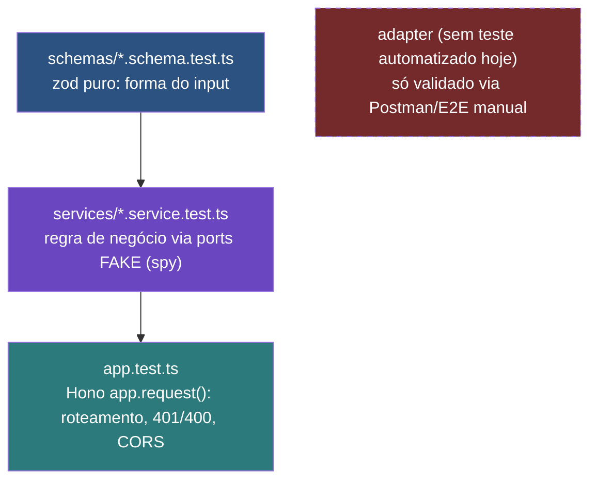

# ADR-0001: Hexagonal (Ports & Adapters) + Hono, em vez de MVC ou DDD tático

- **Status:** Aceito
- **Contexto do projeto:** BayFormFlow back-end — Supabase Edge Functions (Deno) + Postgres
- **Funções afetadas:** `auth`, `researches`, `forms`, `docs`

---

## 1. Contexto

O back-end expõe um número pequeno de operações (provisionar usuário, criar pesquisa, criar/listar formulário) sobre um domínio com poucas invariantes cruzadas, rodando em **Edge Functions isoladas** — cada uma é um processo Deno próprio, sem estado compartilhado entre requests, sem servidor persistente.

Antes de fechar em Hexagonal + transaction script, uma abordagem com **DDD tático completo** (aggregates ricos, Value Objects, Domain Events, Repository por Aggregate) foi tentada/considerada, com base em experiência prévia do time nesse estilo em outro projeto. Este documento registra por que essa rota foi abandonada aqui, por que MVC nunca foi opção real, e por que a arquitetura atual é Hexagonal com Hono.

---

## 2. Diagrama — arquitetura atual (por função)



Cada camada só conhece a camada imediatamente abaixo pela **interface** (port), nunca pela implementação. `service` nunca importa `supabase-js` diretamente — só recebe `ports` como parâmetro.

---

## 3. Diagrama — fluxo real de `POST /forms`



O ponto marcado com `Note` é exatamente o problema tratado no POC (seção 8): não há transação real cobrindo os dois inserts, só uma compensação manual que pode falhar também.

---

## 4. Decisão

Adotar **Hexagonal / Ports & Adapters** por função, com **transaction script** no lugar de domínio rico tático, e **Hono** como framework HTTP.



---

## 5. Por que não MVC

MVC pressupõe:
- Um **Model** ativo (tipicamente um ORM com `save()`/`find()`), com estado e comportamento juntos.
- Uma **View** server-side pra renderizar.
- Um **Controller** que orquestra os dois em resposta a uma requisição de navegador.

Nada disso se aplica aqui: a API é stateless, não renderiza HTML de domínio (a única "view" do projeto é o Swagger estático da função `docs`), e não existe um Model ativo — a persistência é sempre explícita via port/adapter. O que aparece com nome de "controller" no código (`forms.controller.ts`) é só um tradutor HTTP→service de ~5 linhas; batizá-lo de "Controller MVC" seria enganoso porque ele não orquestra Model+View, só repassa.

---

## 6. Por que não DDD tático — a tentativa e o porquê de recuar

A ideia de aggregates ricos (`Form` como Aggregate Root controlando suas `FormVersion`, com invariantes internas, Value Objects para `TimePeriod`/`DisplayName`, e Domain Events tipo `FormCreated`) foi avaliada com base em experiência anterior do time com esse padrão. Os pontos que pesaram contra, para *este* domínio e *esta* infraestrutura:

1. **Isolate sem estado entre requests.** Cada Edge Function é um processo Deno de vida curta. Um Aggregate "vivo" na memória, que é a razão de ser do padrão tático (encapsular invariantes num objeto que muda de estado ao longo do tempo), não existe aqui — toda request sempre re-hidrata do zero e persiste no fim. A "riqueza" do aggregate colapsa em validar invariantes no load/save, que os `schemas/*.schema.ts` (zod) e os `services/*.service.ts` já fazem sem precisar de uma classe de domínio.

2. **Sem infraestrutura para Domain Events.** Domain Events tático pedem um publicador (outbox table, fila, event bus). O projeto não tem nenhum desses hoje — declarar `class FormCreatedEvent` sem ninguém consumindo seria estrutura morta.

3. **Value Objects viram wrappers finos duplicando o zod.** Em TS, um VO tipo `DisplayName` (que valida regex e comprimento) faz exatamente o que `createFormSchema` já faz na borda HTTP. Ter os dois é pagar duas vezes pela mesma garantia.

4. **Repository por Aggregate é mais largo do que o necessário.** DDD tático tende a um `FormRepository` com CRUD completo do aggregate. Aqui os ports são desenhados **por caso de uso** (`FormsRepoPort.createFormWithVersion`, `.researchExists`, `.isResearchManager`) — Interface Segregation na prática: cada método existe porque um service específico precisa dele, não porque "todo repository precisa de CRUD".

5. **Tamanho do domínio não justifica o custo.** DDD tático se paga quando há muitas invariantes cruzando entidades e regras que mudam com frequência. Hoje o domínio tem poucas operações por bounded context; o custo de modelagem (VOs, aggregates, repositórios ricos, mapeamento objeto-relacional manual sem ORM maduro no Deno edge runtime) supera o ganho.

**Isso não é definitivo.** Se `researches`/`forms`/`participants` ganharem regras de negócio cruzadas mais complexas (ex.: máquina de estados de publicação com transições restritas, versionamento com regras de compatibilidade entre `t_form_versions`), DDD tático nessas áreas específicas volta a ser candidato natural — não é preciso reescrever tudo, dá pra introduzir aggregates só onde a complexidade justificar.

---

## 7. Por que Hexagonal (Ports & Adapters) — sim

| Motivo | Como aparece no código |
|---|---|
| Testar regra de negócio sem banco | `create-form.service.test.ts` mocka `FormsRepoPort` inteiro com spies — nenhum teste de service toca Supabase |
| Trocar infra sem tocar domínio | Se sair do Supabase, só `supabase-forms-repo.adapter.ts` muda; `create-form.service.ts` fica igual |
| Fronteira de validação clara | `zValidator` no `app.ts` garante que o `service` nunca vê payload malformado |
| Combina com deploy por função | Cada Edge Function já é uma unidade de deploy/escala isolada — hexagonal por função não introduz uma camada extra, só formaliza o que a plataforma já impõe |

---

## 8. Por que Hono — decisão por decisão

| Decisão | Motivo |
|---|---|
| Framework HTTP em vez de `Deno.serve` cru | Roteamento, middleware (CORS, auth) e parsing de request/response viram declarativos; escrever isso à mão em cada function repetiria boilerplate em `auth`, `forms`, `researches`, `docs`. |
| Hono especificamente (vs Express/Oak) | Roda nativo no Deno/edge-runtime sem camada de compatibilidade Node; footprint pequeno, cold start baixo — relevante porque cada Edge Function é um isolate que pode ser recriado a qualquer momento (ver `wall clock duration warning` / `early termination` observado nos logs locais). |
| `cors()` configurado por função, não num gateway central | Kong (gateway do Supabase) não decide o CORS de cada function; cada uma define sua própria política porque os consumidores diferem — `docs` é público (`origin: "*"`), `forms`/`researches` restritos a `http://127.0.0.1:3000`. |
| `zValidator("json"/"query", schema)` no boundary | Falha rápido antes do controller/service ver dado inválido; separa "isso é uma forma válida" (Hono+zod) de "isso é uma operação válida" (service). |
| `basePath("/forms")` isolado por função | Cada function é seu próprio deploy unit rodando em processo separado; o `basePath` só espelha isso, evita colisão de rota entre functions que nem compartilham runtime. |
| Controller fininho (`Context → service`) | Mantém Hono só na borda HTTP; se um dia trocar Hono por outro framework, `services/` não é afetado. |

---

## 9. Por que os testes são assim (pirâmide por camada)



- **`schema.test.ts`** testa só validação de forma (zod), sem tocar service.
- **`service.test.ts`** é o coração: como `create-form.service.ts` só depende de `CreateFormPorts` (interface), o teste injeta um fake construído na mão (`spy(...)` do `@std/testing/mock`) — sem subir Supabase, sem mockar módulo (`vi.mock`), sem rede. Isso só é possível **porque** a dependência entra por parâmetro (seção 10) e não por import direto do adapter.
- **`app.test.ts`** testa a fronteira HTTP isolada (middleware de auth, validação Zod, CORS) chamando `app.request(...)` do Hono diretamente, sem rede real — mas também sem ir até o service de fato (não sobe token válido).
- **Gap real, vale nomear:** não há teste automatizado do `adapter` (SQL/RPC de fato) — hoje isso só é coberto manualmente via a collection Postman contra o Supabase local. Se o domínio crescer, esse é o próximo buraco a fechar (teste de integração contra Postgres real, ex. via `supabase test db` ou um Postgres efêmero em CI).

---

## 10. Por que Injeção de Dependência assim (manual, via factory `buildPorts`)

```ts
// deps.ts
export function buildPorts(req: Request): CreateFormPorts {
  const caller = createSupabaseClient(req);
  const admin = createSupabaseAdminClient();
  return {
    admin: createSupabaseAdminAdapter(caller),
    repos: createSupabaseFormsRepoAdapter(admin),
  };
}
```

- **Não é um container de DI** (nada de `tsyringe`, `inversify`, decorators, `reflect-metadata`). É "poor man's DI": uma função-fábrica que monta o objeto de dependências e passa como argumento comum.
- **Por quê:** containers de DI com reflection têm custo de bootstrap e, em Deno/edge runtime com isolates de vida curta, esse custo pesa proporcionalmente mais do que num servidor long-running. Uma função-fábrica chamada uma vez por request é suficiente e não paga esse preço.
- **O que isso compra:** o `service` nunca importa `@supabase/supabase-js`. Ele recebe `ports: CreateFormPorts` como parâmetro — isso é literalmente "constructor injection" aplicado a funções em vez de classes. É o que permite o teste de service da seção 9 não precisar de `vi.mock`/`spyOn` em módulo nenhum: basta montar um objeto literal que satisfaça a interface.
- **Trade-off aceito:** `buildPorts` se repete quase igual em `auth`, `forms`, `researches` (boilerplate já apontado na análise anterior) — o preço de não ter um container central que resolveria isso automaticamente. Om domínio atual, esse preço é menor que a complexidade de introduzir um container de DI.

---

## 11. Consequências

**Positivas**
- Service 100% testável sem infraestrutura externa.
- Troca de Supabase por outro provider = só reescrever adapters.
- Cada function escala e faz deploy independente, sem acoplamento de runtime entre `auth`/`forms`/`researches`/`docs`.

**Negativas / dívida assumida conscientemente**
- Sem transação real entre múltiplos inserts relacionados → mitigado pontualmente pelo POC da seção 12.
- Regra de autorização (`isResearchManager`) hoje mora parcialmente no adapter, não só no service — vazamento de responsabilidade a corrigir.
- Zero cache em qualquer camada (identidade `me()`, listagens) — candidato a otimização quando o tráfego justificar.
- `buildPorts`/composição duplicada entre functions.
- Sem teste automatizado de adapter (gap de cobertura, seção 9).

---

## 12. POC — RPC transacional para `createForm`

### Problema concreto

`create-form.service.ts` hoje faz **insert do form → insert da versão → DELETE de compensação** se o segundo falhar. Não é atômico: se o processo morrer entre os dois inserts, ou o `DELETE` de rollback falhar, sobra um formulário órfão — o próprio código já loga esse cenário como esperado (`[ROLLBACK FALHOU] Formulário ÓRFÃO`).

Achado relevante: **o projeto já tem precedente do padrão certo**, não usado de forma consistente — `helpers.provision_operator` (migration `V007`) é uma function Postgres transacional (`SECURITY DEFINER`, insere `t_users` + `t_employees` numa só chamada), mas `provisioning.service.ts` **não a chama**; ele repete a mesma saga manual com compensação (`undoAuthUser`/`undoUserRow`) que `forms` usa. O padrão certo já foi desenhado uma vez (V007/V008) e não foi generalizado.

### Diagrama — antes vs. depois

```mermaid
sequenceDiagram
    participant Svc as service (ANTES)
    participant DB as Postgres

    rect rgb(90, 30, 30)
    Note over Svc,DB: Hoje — dois statements + compensação manual
    Svc->>DB: INSERT t_forms
    DB-->>Svc: form_id (já commitado)
    Svc->>DB: INSERT t_form_versions
    DB--xSvc: falha
    Svc->>DB: DELETE t_forms (pode falhar também)
    end
```

```mermaid
sequenceDiagram
    participant Svc as service (DEPOIS)
    participant RPC as helpers.create_form_with_version
    participant DB as Postgres

    rect rgb(30, 70, 40)
    Note over Svc,DB: Proposto — um único statement atômico
    Svc->>RPC: rpc("create_form_with_version", {...})
    RPC->>DB: INSERT t_forms
    RPC->>DB: INSERT t_form_versions
    alt qualquer erro
        DB--xRPC: exceção
        RPC--xSvc: erro (nenhuma linha persistida)
    else sucesso
        DB-->>RPC: ok
        RPC-->>Svc: { form_id, form_version_id }
    end
    end
```





### Migration (segue o padrão de `V007__create_func_provision_operator.sql`)

```sql
CREATE OR REPLACE FUNCTION helpers.create_form_with_version(
    p_display_name        VARCHAR(120),
    p_forms_description   VARCHAR(2000),
    p_period_start         TIMESTAMPTZ,
    p_period_end           TIMESTAMPTZ,
    p_participant_target   SMALLINT,
    p_research_id          INT,
    p_form                 JSONB,
    p_version_name         VARCHAR(10),
    p_created_by           UUID
)
RETURNS jsonb
LANGUAGE plpgsql
SECURITY DEFINER
SET search_path = ''
AS $$
DECLARE
    v_form_id    UUID;
    v_version_id UUID;
BEGIN
    INSERT INTO consultancies.t_forms (
        display_name, forms_description, time_period,
        participant_target, research_id, created_by
    )
    VALUES (
        p_display_name, p_forms_description,
        tstzrange(p_period_start, p_period_end, '[)'),
        p_participant_target, p_research_id, p_created_by
    )
    RETURNING id INTO v_form_id;

    INSERT INTO consultancies.t_form_versions (
        form, version_status, version_name, form_id, created_by
    )
    VALUES (
        p_form, 'Em Análise', p_version_name, v_form_id, p_created_by
    )
    RETURNING id INTO v_version_id;

    RETURN jsonb_build_object(
        'form_id', v_form_id,
        'form_version_id', v_version_id
    );
END;
$$;

REVOKE EXECUTE ON FUNCTION helpers.create_form_with_version(
    VARCHAR, VARCHAR, TIMESTAMPTZ, TIMESTAMPTZ, SMALLINT, INT, JSONB, VARCHAR, UUID
) FROM public;
GRANT EXECUTE ON FUNCTION helpers.create_form_with_version(
    VARCHAR, VARCHAR, TIMESTAMPTZ, TIMESTAMPTZ, SMALLINT, INT, JSONB, VARCHAR, UUID
) TO service_role;
```

Nenhum bloco `EXCEPTION` é declarado de propósito: sem ele, qualquer erro (violação de FK/CHECK/UNIQUE) aborta a função inteira, e como a chamada RPC roda dentro da transação implícita do PostgREST, as duas gravações são desfeitas juntas.

### Adapter — `FormsRepoPort` ganha um método atômico no lugar de três

```ts
// port
export interface CreateFormWithVersionInput {
  displayName: string;
  formsDescription: string;
  periodStart: string;
  periodEnd: string;
  participantTarget: number;
  researchId: number;
  form: Record<string, unknown>;
  versionName: string;
  createdBy: string;
}

export type CreateFormWithVersionResult =
  | { ok: true; formId: string; formVersionId: string }
  | { ok: false; kind: "constraint" | "unknown"; error: string };

export interface FormsRepoPort {
  researchExists(researchId: number): Promise<boolean>;
  isResearchManager(callerUserId: string, researchId: number): Promise<boolean>;
  createFormWithVersion(input: CreateFormWithVersionInput): Promise<CreateFormWithVersionResult>;
  listForms(filter: ListFormsFilter): Promise<FormSummaryRow[]>;
}
```

```ts
// adapter
async createFormWithVersion(input: CreateFormWithVersionInput): Promise<CreateFormWithVersionResult> {
  const { data, error } = await admin.schema("helpers").rpc("create_form_with_version", {
    p_display_name: input.displayName,
    p_forms_description: input.formsDescription,
    p_period_start: input.periodStart,
    p_period_end: input.periodEnd,
    p_participant_target: input.participantTarget,
    p_research_id: input.researchId,
    p_form: input.form,
    p_version_name: input.versionName,
    p_created_by: input.createdBy,
  }).single();

  if (error) {
    const kind = CONSTRAINT_SQLSTATES.has(error.code) ? "constraint" : "unknown";
    return { ok: false, kind, error: error.message };
  }
  const row = data as { form_id: string; form_version_id: string };
  return { ok: true, formId: row.form_id, formVersionId: row.form_version_id };
}
```

### Service — perde a compensação manual inteira

```ts
export async function createForm(ports: CreateFormPorts, input: CreateFormInput): Promise<ServiceResponse> {
  const caller = await ports.admin.me();
  if (!caller) return { status: 403, body: { error: "Autenticação necessária." } };

  if (!caller.isAdmin) {
    const isManager = await ports.repos.isResearchManager(caller.userId, input.research_id);
    if (!isManager) {
      return { status: 403, body: { error: "Apenas administradores ou o gestor responsável pela pesquisa podem criar formulários." } };
    }
  }

  const researchExists = await ports.repos.researchExists(input.research_id);
  if (!researchExists) return { status: 400, body: { error: "research_id inexistente." } };

  const result = await ports.repos.createFormWithVersion({
    displayName: input.display_name,
    formsDescription: input.forms_description,
    periodStart: input.time_period.start,
    periodEnd: input.time_period.end,
    participantTarget: input.participant_target,
    researchId: input.research_id,
    form: input.form,
    versionName: input.version_name ?? "v1",
    createdBy: caller.userId,
  });

  if (!result.ok) {
    if (result.kind === "constraint") {
      return { status: 400, body: { error: "Falha ao criar formulário.", detail: result.error } };
    }
    return { status: 500, body: { error: "Falha inesperada ao criar formulário.", detail: result.error } };
  }

  return { status: 201, body: { form_id: result.formId, form_version_id: result.formVersionId } };
}
```

`undoForm()` deixa de existir — não há mais estado intermediário pra desfazer. O teste que hoje cobre `"insertFormVersion falha → 500 e rollback do formulário"` deixa de fazer sentido (esse cenário de falha parcial não existe mais) e é substituído por um teste único de falha do `createFormWithVersion`.

### Escopo aplicável ao mesmo padrão

O mesmo problema existe em `provisioning.service.ts` (`undoAuthUser`/`undoUserRow`), e a function `helpers.provision_operator` já resolveria — só falta o adapter de `auth` chamá-la em vez de fazer os inserts diretos.

---

## 13. Status deste documento

Este ADR é registro de decisão + POC ilustrativo. **Nada aqui foi aplicado ao código do projeto** — nenhuma migration, port, adapter ou service foi alterado; o conteúdo das seções 12 existe só neste arquivo.
